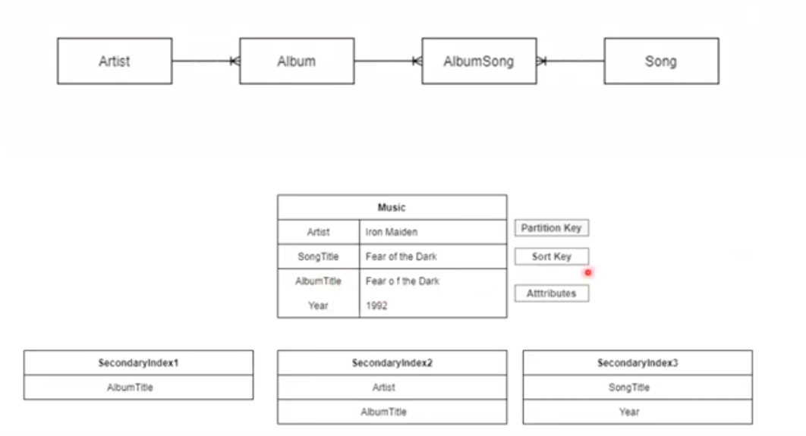

# DynamoDB: best practices

Best if used for microsservices; 

What take care:

- Access patterns: how itens will be accessed -> this cannot be changed after

- Business rules defined and understood

- Dimension - what will be the charge levels - in demand or provisionaded

- Minimum number of indexes

- Eficient design - weight, format and velocity of data

## Project Architecture 



## How to create a table in DynamoDB using Amazon CLI

- Create Table

```
aws dynamodb create-table \
    --table-name Music \
    --attribute-definitions \
        AttributeName=Artist,AttributeType=S \
        AttributeName=SongTitle,AttributeType=S \
    --key-schema \
        AttributeName=Artist,KeyType=HASH \
        AttributeName=SongTitle,KeyType=RANGE \
    --provisioned-throughput \
        ReadCapacityUnits=10,WriteCapacityUnits=5
```

- Inssert Item

```
aws dynamodb put-item \
    --table-name Music \
    --item file://itemmusic.json \
```

- Insert multiple itens

```
aws dynamodb batch-write-item \
    --request-items file://batchmusic.json
```

- Create a global secundary index based on the Album title

```
aws dynamodb update-table \
    --table-name Music \
    --attribute-definitions AttributeName=AlbumTitle,AttributeType=S \
    --global-secondary-index-updates \
        "[{\"Create\":{\"IndexName\": \"AlbumTitle-index\",\"KeySchema\":[{\"AttributeName\":\"AlbumTitle\",\"KeyType\":\"HASH\"}], \
        \"ProvisionedThroughput\": {\"ReadCapacityUnits\": 10, \"WriteCapacityUnits\": 5      },\"Projection\":{\"ProjectionType\":\"ALL\"}}}]"
```

- Create a global secundary index based on the Album's title and artist's name


```
aws dynamodb update-table \
    --table-name Music \
    --attribute-definitions\
        AttributeName=Artist,AttributeType=S \
        AttributeName=AlbumTitle,AttributeType=S \
    --global-secondary-index-updates \
        "[{\"Create\":{\"IndexName\": \"ArtistAlbumTitle-index\",\"KeySchema\":[{\"AttributeName\":\"Artist\",\"KeyType\":\"HASH\"}, {\"AttributeName\":\"AlbumTitle\",\"KeyType\":\"RANGE\"}], \
        \"ProvisionedThroughput\": {\"ReadCapacityUnits\": 10, \"WriteCapacityUnits\": 5      },\"Projection\":{\"ProjectionType\":\"ALL\"}}}]"
```

- Create a global secundary index based on the song title and year


```
aws dynamodb update-table \
    --table-name Music \
    --attribute-definitions\
        AttributeName=SongTitle,AttributeType=S \
        AttributeName=SongYear,AttributeType=S \
    --global-secondary-index-updates \
        "[{\"Create\":{\"IndexName\": \"SongTitleYear-index\",\"KeySchema\":[{\"AttributeName\":\"SongTitle\",\"KeyType\":\"HASH\"}, {\"AttributeName\":\"SongYear\",\"KeyType\":\"RANGE\"}], \
        \"ProvisionedThroughput\": {\"ReadCapacityUnits\": 10, \"WriteCapacityUnits\": 5      },\"Projection\":{\"ProjectionType\":\"ALL\"}}}]"
```

- Search item for artist

```
aws dynamodb query \
    --table-name Music \
    --key-condition-expression "Artist = :artist" \
    --expression-attribute-values  '{":artist":{"S":"Iron Maiden"}}'
```
- Search item for artist and song title 

```
aws dynamodb query \
    --table-name Music \
    --key-condition-expression "Artist = :artist and SongTitle = :title" \
    --expression-attribute-values file://keyconditions.json
```

- Search for the global secundary index based on the Album title


```
aws dynamodb query \
    --table-name Music \
    --index-name AlbumTitle-index \
    --key-condition-expression "AlbumTitle = :name" \
    --expression-attribute-values  '{":name":{"S":"Fear of the Dark"}}'
```

- Search for the global secundary index based on the artist's name and Album title


```
aws dynamodb query \
    --table-name Music \
    --index-name ArtistAlbumTitle-index \
    --key-condition-expression "Artist = :v_artist and AlbumTitle = :v_title" \
    --expression-attribute-values  '{":v_artist":{"S":"Iron Maiden"},":v_title":{"S":"Fear of the Dark"} }'
```

- Search for the global secundary index based on the song title and year


```
aws dynamodb query \
    --table-name Music \
    --index-name SongTitleYear-index \
    --key-condition-expression "SongTitle = :v_song and SongYear = :v_year" \
    --expression-attribute-values  '{":v_song":{"S":"Wasting Love"},":v_year":{"S":"1992"} }'
```
